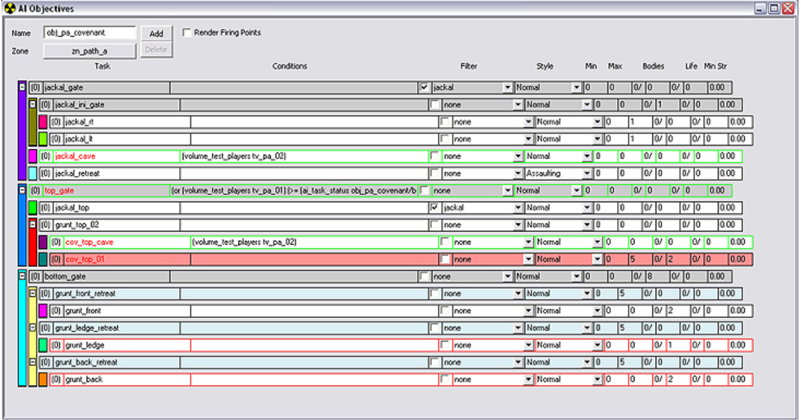
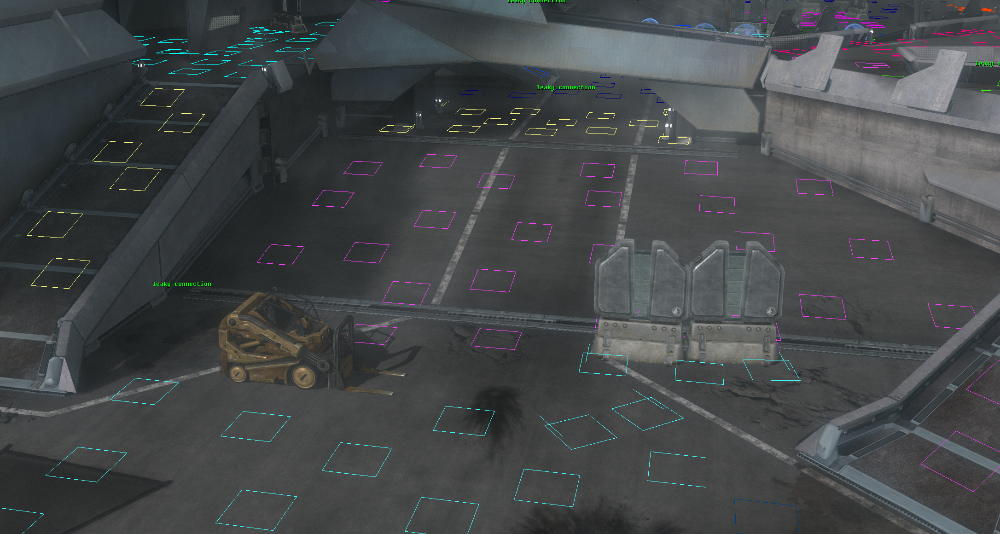
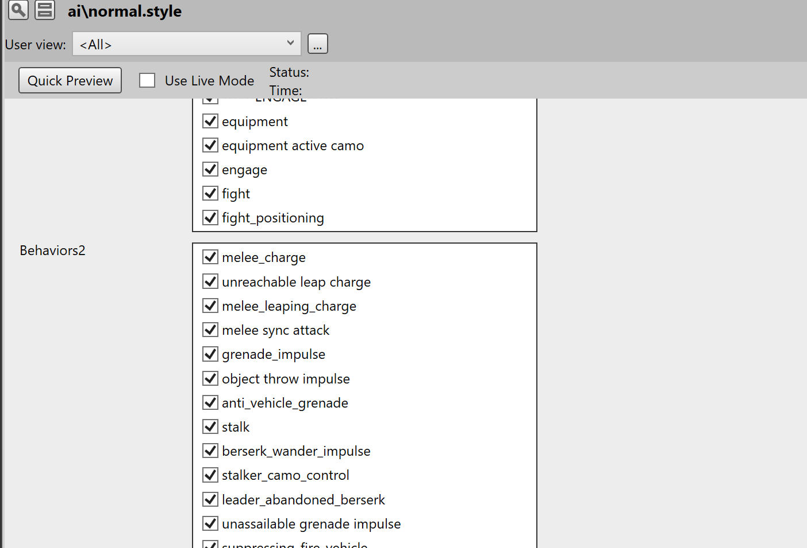

# Scenario Forge

**Scenario Forge** is an AI simulation framework for building intelligent agents and squads using **Goal-Oriented Action Planning (GOAP)** instead of hand-authored behavior trees or finite state machines.

The project is designed for simulations where agents need to make flexible, explainable decisions without requiring developers to manually define thousands of transitions. Scenario Forge allows agents to evaluate goals, select actions, adapt behavioral weights, coordinate with squads, and fall back to alternate objectives when plans fail.

Rather than forcing designers to tune every behavior by hand, Scenario Forge aims to use algorithms to adjust agent priorities and behavioral weights toward a desired objective. It also provides tools for inspecting and explaining why individual agents or squads chose specific actions, making AI behavior easier to debug, analyze, and trust.

Scenario Forge can be used as a standalone simulation tool, an Unreal Engine plugin, or a foundation for specialized AI systems in games, military simulations, training environments, logistics, robotics, education, or everyday planning scenarios. Whether simulating squad tactics, game NPCs, or a team baking cakes, Scenario Forge helps turn high-level objectives into coordinated, explainable action.

## Tagline

**Explainable GOAP-based AI for adaptive agents, squads, and simulations.**

## Objective System

Objectives are a high-level AI encounter tool that lets designers control battles by assigning squads to objectives made up of prioritized tasks. Rather than scripting every enemy's exact movements, designers define roles such as advancing, defending, retreating, following the player, using vehicles, holding areas, or attacking from specific positions.

The system evaluates conditions, priorities, filters, squad types, task limits, and combat states to decide where each squad should go and what it should focus on. This makes encounters feel dynamic because squads can shift behavior as the fight changes, such as falling back after losses, pushing forward when another group retreats, or changing tactics when the player reaches a certain area.

The Objective Window also helps designers debug these behaviors visually through color and outline cues that show whether tasks are disabled, single-use, gate-based, or latched on or off. Overall, the Objective System separates broad battle planning from individual AI decision-making, allowing encounters to feel coordinated, reactive, and cinematic without relying on one rigid script.

## Areas

Areas are smaller tactical subdivisions inside a zone. An area represents a more specific pocket of usable combat space, such as one side of a room, a balcony, a cover cluster, a doorway position, or a group of firing positions.

While zones define the broad encounter region, areas define where AI can actually position themselves within that region. AI can use areas to choose cover, spread out, hold ground, search locally, or move between nearby tactical positions. In an Unreal implementation, areas act as local decision spaces inside a zone, helping AI pick useful positions without requiring every movement to be directly scripted.

## Firing Positions

Firing positions are specific points inside an area that AI can use as tactical locations during combat. They represent places where an actor can stand, shoot, take cover, lean around corners, hold a defensive angle, or reposition during a fight.

While a zone defines the broad encounter space and an area defines a smaller pocket of usable space, firing positions are the individual spots the AI evaluates when deciding where to fight from. In an Unreal implementation, firing positions can be placed or generated points with metadata such as open, partial cover, closed cover, wall-lean, perch, or ground-point behavior. AI controllers can score these positions based on visibility, cover, distance, threat direction, squad spacing, and objective needs, then move actors to the best available point for the current situation.

## Style Sheets

Style sheets define the set of actions and behaviors available to an AI character. Designers can enable or disable individual behavior flags to control what that AI is permitted to do. Each AI character can be assigned its own style sheet, allowing behavior capabilities to be customized on a per-agent basis.

This lets designers create distinct AI roles without rewriting behavior logic. For example, one agent can be allowed to advance, take cover, and throw grenades, while another can be limited to defending, suppressing, or holding a fixed position. Style sheets keep AI behavior authoring readable by separating what an agent is allowed to do from the lower-level decision logic that chooses when to do it.
