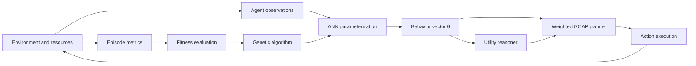

# Scenario Forge

## An Experimental Framework for Evolutionary Goal-Oriented Agents

Scenario Forge is an Unreal Engine research project for studying whether a hybrid architecture combining **Goal-Oriented Action Planning (GOAP)**, **artificial neural networks (ANNs)**, and **genetic algorithms (GAs)** can improve an autonomous agent's ability to accomplish a goal in an unfamiliar environment.

The central experimental constraint is that an agent's available actions remain fixed. Adaptation occurs by changing the numerical parameters that influence how those actions are selected and executed, including action costs, goal utility, risk tolerance, resource conservation, and grenade-use frequency. This separates the question of *what an agent can do* from the question of *how it chooses to behave*.

> **Research question:** Can learned and evolved behavioral parameters improve goal completion and generalization across novel environments without modifying the agent's underlying action set?

## Abstract

Autonomous agents operating in dynamic environments must choose actions under uncertainty, limited resources, and competing objectives. Hand-authored decision parameters can produce competent behavior in known scenarios, but they may not transfer to new environmental configurations. Scenario Forge investigates a hybrid approach in which GOAP supplies interpretable symbolic planning, an ANN maps observations to context-sensitive behavioral parameters, and a GA searches the parameter space across repeated simulations.

Each experiment provides a group of agents with a goal, a fixed action set, finite resources, and an environment that was not used to author a scenario-specific plan. During a simulation, agents perceive world state, select goals by utility, and construct action sequences using a weighted GOAP planner. Between simulations, behavioral parameters are varied or evolved while agent capabilities remain constant. Performance is evaluated using goal completion, completion time, survival, resource expenditure, and robustness on held-out environments.

Scenario Forge is intended to serve both as an executable AI simulation and as an experimental platform for comparing fixed, learned, evolutionary, and hybrid decision policies.

## 1. Research Objectives

The project is designed to test the following hypotheses:

- **H1 — Parameter adaptation:** Agents with optimized behavioral parameters will achieve a higher goal-completion rate than agents using fixed, manually authored parameters.

- **H2 — Evolutionary optimization:** A genetic algorithm will discover useful combinations of action costs and behavioral preferences that are difficult to identify through isolated manual tuning.

- **H3 — Context sensitivity:** An ANN that conditions behavioral parameters on the observed state will outperform a single static parameter vector when environments vary substantially.

- **H4 — Hybrid performance:** Combining ANN-based adaptation with GA-based optimization will provide better performance or generalization than GOAP, ANN-conditioned GOAP, or GA-optimized GOAP alone.

These are experimental hypotheses, not claims of demonstrated results. They require controlled trials and statistical analysis.

## 2. System Model

An experiment is represented by:

- a set of agents, \( \mathcal{N} \);
- an environment, \( E \);
- a shared or agent-specific goal specification, \( G \);
- a fixed action set, \( \mathcal{A} \);
- a resource allocation, \( R \); and
- a behavioral parameter vector, \( \theta \).

The action set defines the agent's capabilities. Each action contains symbolic preconditions and effects expressed as gameplay tags. The parameter vector changes the relative desirability or execution characteristics of those actions without adding or removing capabilities.

Examples of parameters in \( \theta \) include:

- GOAP action costs;
- goal-importance scores;
- acceptable exposure or risk;
- cover and dodge preferences;
- firing cadence;
- grenade-use probability and delay;
- resource-conservation pressure; and
- perception or reaction characteristics.

For a world state \( s \), the planner searches for a valid action sequence \( \pi \) that satisfies the selected goal while minimizing cumulative parameterized cost:

$$
\pi^*(s, G, \theta)
=
\underset{\pi}{\operatorname{arg\,min}}
\sum_{a \in \pi} c(a \mid s, \theta)
$$

The current planner performs an A*-style search over gameplay-tag states. Action preconditions determine valid state expansions, action effects produce successor states, and Agent Sheet values provide non-negative action costs.

## 3. Proposed Hybrid Architecture

### 3.1 Utility reasoner

The reasoner evaluates unsatisfied goals against the current symbolic world state. It selects the eligible goal with the highest utility and supplies that goal's desired true and false states to the planner.

### 3.2 GOAP planner

The planner searches the fixed action library for a low-cost sequence that satisfies the selected goal. Because plans are generated from current state rather than scripted for a particular map, the agent can replan after perception changes, action failure, danger, or resource loss.

### 3.3 Artificial neural network

The proposed ANN receives a numerical encoding of the current agent and environment state. Its output parameterizes action costs or other bounded behavioral controls. The ANN therefore does not replace symbolic planning; it changes the preferences used by the planner and action systems.

A candidate mapping is:

$$
\theta_t = f_{\phi}(x_t)
$$

where \(x_t\) is the observation vector, \(f_{\phi}\) is the ANN with parameters \(\phi\), and \(\theta_t\) is the behavioral parameter vector used during decision-making.

### 3.4 Genetic algorithm

The proposed GA maintains a population of candidate parameter vectors or ANN parameter sets. Each candidate is evaluated over one or more simulation episodes. Selection, crossover, and mutation generate the next population from candidates with higher fitness.

The GA operates between simulations. It does not change the action definitions or grant privileged scenario-specific knowledge to an agent.

## 4. Experimental Procedure

One experimental generation follows this procedure:

1. Select a training environment and initialize its random seed.
2. Spawn agents with the same permitted goals, actions, and starting resource budget.
3. Assign each candidate agent or team a behavioral parameter vector.
4. Run the simulation until the goal is completed, a failure condition occurs, or the time limit is reached.
5. Record behavioral and outcome metrics.
6. Calculate candidate fitness.
7. Produce a new candidate population through selection, crossover, and mutation.
8. Repeat across multiple seeds and environment configurations.
9. Evaluate the final candidates on held-out environments that were not used during optimization.

The use of held-out environments is necessary to distinguish general behavioral adaptation from overfitting to a particular map, opponent placement, or random seed.

## 5. Experimental Conditions

The intended evaluation compares the following conditions:

| Condition | GOAP | ANN-conditioned parameters | Genetic optimization |
|---|:---:|:---:|:---:|
| Fixed baseline | Yes | No | No |
| Randomized-parameter baseline | Yes | No | No |
| Evolutionary GOAP | Yes | No | Yes |
| Neural adaptive GOAP | Yes | Yes | No |
| Hybrid evolutionary-neural GOAP | Yes | Yes | Yes |

All conditions should use the same action implementations, goals, resources, spawn rules, and environment distribution. Only the parameter-generation method should change.

## 6. Measurement

### Primary outcome

- **Goal-completion rate:** proportion of trials in which the assigned goal is satisfied before a terminal condition or time limit.

### Secondary outcomes

- time or simulation steps required to complete the goal;
- proportion of agents surviving or remaining operational;
- ammunition, grenades, health, and other resources consumed;
- damage inflicted and received;
- number and average length of generated plans;
- replanning frequency and action-failure rate;
- cumulative path or action cost;
- fitness variance across random seeds; and
- performance degradation between training and held-out environments.

A fitness function may combine several normalized outcomes:

$$
F =
w_g G
- w_t T
- w_l L
- w_r R
+ w_s S
$$

where \(G\) represents goal completion, \(T\) completion time, \(L\) agent losses, \(R\) resource expenditure, \(S\) survival or residual capability, and each \(w\) is an experiment-defined coefficient. Every reported experiment should publish these coefficients because they directly define the behavior being optimized.

## 7. Controls and Reproducibility

Experiments should record:

- Unreal Engine and project revision;
- scenario identifier and environment configuration;
- pseudorandom seed;
- agent and team configuration;
- action and goal definitions;
- initial resources;
- behavioral parameter vector or ANN checkpoint;
- GA population and operator settings;
- termination conditions;
- fitness coefficients; and
- raw per-episode measurements.

Repeated trials should use matched seed sets across experimental conditions. Training, validation, and test environments should be separated before optimization begins.

## 8. Current Implementation Status

Scenario Forge is under active development. The repository currently provides the symbolic planning and simulation substrate; the learning and evolutionary experiment layers remain planned work.

| Component | Status |
|---|---|
| Gameplay-tag world-state representation | Implemented |
| Utility-based goal selection | Implemented |
| Weighted A*-style GOAP planning | Implemented |
| Runtime replanning and interruptible actions | Implemented |
| Agent Sheet inheritance and parameter authoring | Implemented |
| Perception, combat, cover, danger, weapons, and resources | In development |
| Automated episode runner and metric logging | Planned |
| Genetic population, fitness, selection, crossover, and mutation | Planned |
| ANN observation encoding and parameter output | Planned |
| Training/validation/test scenario pipeline | Planned |
| Statistical analysis and published experimental results | Planned |

No empirical conclusion should be inferred from the repository until the automated experiment pipeline and controlled evaluations are complete.

## 9. Software Architecture

The primary runtime systems are:

- `UReasoner` — selects the highest-utility eligible goal;
- `UPlanner` — searches gameplay-tag states and executes weighted action plans;
- `UGoal` — defines desired true and false world states;
- `UAction` — defines preconditions, effects, execution, and interruption behavior;
- `UAgentSheet` — stores inheritable goals, action costs, resources, and behavioral parameters;
- `AAgentAIController` — coordinates perception, reasoning, planning, and concurrent combat behavior;
- `AAgent` — owns movement, equipment, vitality, and the Gameplay Ability System; and
- Unreal Engine subsystems for AI Perception, EQS, Smart Objects, Gameplay Tags, and Gameplay Abilities.

Implemented actions currently include firing, melee combat, grenade use, cover seeking, peeking, danger avoidance, movement to safety, and idling.

## 10. Requirements and Build

- Unreal Engine **5.7**
- A C++ toolchain supported by the selected Unreal Engine installation
- Gameplay Abilities, Smart Objects, and Gameplay Interactions plugins

To build from the Unreal Editor:

1. Open `ScenarioForge.uproject`.
2. Allow Unreal Engine to compile the `ScenarioForge` runtime module if prompted.
3. Open or create an experimental map.
4. Configure agents through Agent Sheet data assets.

For command-line or IDE builds, generate project files for `ScenarioForge.uproject` and build the `ScenarioForgeEditor` target in the desired configuration.

## 11. Limitations

- The ANN and GA portions described above are the proposed experimental architecture and are not yet implemented.
- Current behavior parameters are authored through Unreal data assets rather than produced by a training pipeline.
- The present simulation domain is combat-oriented, so conclusions may not transfer to non-combat planning tasks without additional experiments.
- Fitness design can strongly bias evolved behavior and must be treated as part of the experimental method.
- Successful performance in training environments does not by itself demonstrate generalization.

## 12. Research Roadmap

1. Define a versioned numerical schema for observations and behavioral parameters.
2. Implement deterministic episode initialization and termination.
3. Record structured per-agent and per-team telemetry.
4. Establish fixed and randomized GOAP baselines.
5. Implement the GA and validate it on a small parameter space.
6. Add ANN-conditioned parameter generation.
7. Optimize candidates across diverse training environments.
8. Evaluate frozen candidates on held-out environments.
9. Report confidence intervals, effect sizes, and ablation results.

## Project Status

Scenario Forge is a research prototype. Its architecture, parameterization, and experimental protocol may change as the simulation runner and optimization systems are developed.
