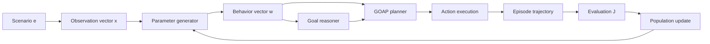

# Scenario Forge

## An Experimental Framework for Adaptive Goal-Oriented Agents

Scenario Forge is an Unreal Engine research project for studying whether **Goal-Oriented Action Planning (GOAP)**, **artificial neural networks (ANNs)**, and **genetic algorithms (GAs)** can improve an autonomous agent's ability to accomplish a goal in a previously unseen environment.

The central experimental constraint is that the available goals and actions remain fixed across comparable trials. Adaptation occurs through numerical parameters that influence action selection and execution. These parameters may represent action costs, goal utilities, preferences, thresholds, or other continuous controls. A new parameterization can be evaluated in each simulation without changing what the agent is capable of doing.

> **Research question:** Can learned or evolved behavioral parameters improve goal attainment and generalization while the agent's symbolic action model remains fixed?

## Abstract

Symbolic planners provide interpretable action sequences but depend on parameters that are often selected manually. Scenario Forge investigates whether those parameters can instead be learned or evolved through repeated simulation. GOAP defines valid plans from symbolic preconditions and effects. An ANN may generate context-dependent behavioral parameters from a numerical description of a scenario. A GA may optimize either a direct parameter vector or the parameters of the ANN.

In each trial, one or more agents receive a goal, a fixed action set, an initial state, and an environment. The agents generate and execute plans, producing an episode trajectory and a measurable outcome. Candidate parameterizations are compared over multiple environments and random seeds. Final candidates are evaluated on held-out environments to measure generalization rather than memorization of a particular scenario.

The project is intended to support controlled comparisons among manually configured GOAP, randomly parameterized GOAP, evolutionary optimization, neural parameterization, and hybrid evolutionary-neural methods.

## 1. Hypotheses

- **H1 — Adaptive parameterization:** Optimized parameter vectors will produce better expected goal performance than fixed, manually selected vectors.

- **H2 — Evolutionary search:** A GA will identify useful interactions among behavioral parameters that are difficult to discover through one-at-a-time tuning.

- **H3 — Conditional parameterization:** An ANN that maps scenario observations to behavioral parameters will generalize better than a single parameter vector when environments differ.

- **H4 — Hybrid optimization:** Evolving ANN parameters will outperform at least one non-hybrid baseline under the same action model and evaluation protocol.

These are hypotheses to be tested, not claims of demonstrated results.

## 2. Formal Problem Definition

A simulation trial is defined as:

```text
T = (e, s0, g, A, r0, w)
```

where:

| Symbol | Definition |
|---|---|
| `e` | Environment or scenario configuration |
| `s0` | Initial world state |
| `g` | Goal condition |
| `A` | Fixed set of available actions |
| `r0` | Initial resource vector |
| `w` | Behavioral parameter vector |

Each action `a` in `A` has symbolic preconditions and effects. Let
`ValidPlans(s0, g, A)` denote the set of plans that can transform the initial
state into a state satisfying the goal. GOAP selects the valid plan with the
lowest parameterized cumulative cost:

```text
best plan = arg min over p in ValidPlans(s0, g, A)
            [sum of cost(a_k, s_k; w) for each action a_k in p]
```

Here, `p = (a1, ..., an)`, `s_k` is the state in which action `a_k` is
considered, and `cost(a_k, s_k; w)` is the cost induced by the current
behavioral parameters.

The fixed action model determines which plans are possible. The parameter
vector determines which valid plans are preferred.

## 3. Parameter-Generation Methods

### 3.1 Fixed baseline

A manually authored vector `w` is reused for every simulation. This
provides the primary comparison condition.

### 3.2 Randomized baseline

A vector `w` is sampled independently for each simulation from a
declared distribution. This tests whether optimization performs better than
unstructured parameter variation.

### 3.3 Direct evolutionary optimization

A GA genome `z` directly encodes the behavioral vector:

```text
w = z
```

Each genome is evaluated over a set of simulation trials. Selection, crossover,
and mutation generate subsequent populations.

### 3.4 Neural parameterization

An ANN receives an observation vector `x` describing the current
scenario and produces a behavioral vector:

```text
w = ANN(x; phi)
```

where `phi` is the ANN's trainable parameter vector. The network modifies
planning preferences; it does not replace the symbolic planner or alter the
available actions.

### 3.5 Hybrid evolutionary-neural optimization

In the hybrid condition, the GA genome encodes `phi`. The GA
therefore searches for an ANN that generates useful behavioral vectors for
different environments:

```text
phi = z
w = ANN(x; z)
```

## 4. Evaluation Objective

Executing candidate `z` in environment `e` produces an episode trajectory
`trajectory(e, z)`. A declared evaluation function `J` maps that trajectory and
its goal to a real-valued score:

```text
score = J(trajectory(e, z), goal(e))
```

For a training set `D_train`, evolutionary optimization
seeks a candidate with high mean performance:

```text
best candidate = arg max over z
                 [mean score of z across all environments in D_train]
```

The definition of `J` is part of the experiment and must be reported
explicitly. It may incorporate goal attainment, completion cost, elapsed
simulation time, resource change, constraint violations, or other
domain-independent outcome measures.

## 5. Experimental Architecture



The population update occurs between simulations. Within a simulation, the
reasoner and planner operate from the current world state using the candidate
behavioral parameters.

## 6. Experimental Conditions

| Condition | GOAP | ANN parameter generator | Genetic optimization |
|---|:---:|:---:|:---:|
| Fixed baseline | Yes | No | No |
| Randomized baseline | Yes | No | No |
| Direct evolutionary optimization | Yes | No | Yes |
| Neural parameterization | Yes | Yes | No |
| Hybrid evolutionary-neural optimization | Yes | Yes | Yes |

Comparable conditions must use the same:

- goal definitions;
- action implementations;
- initial-state distribution;
- environment distribution;
- resource model;
- termination conditions; and
- evaluation function.

Only the method used to produce the behavioral parameter vector should differ.

## 7. Experimental Procedure

1. Partition scenario configurations into training, validation, and test sets.
2. Select a candidate parameterization.
3. Initialize a scenario and pseudorandom seed.
4. Run the simulation until goal attainment or a declared termination condition.
5. Record the trajectory and outcome variables.
6. Repeat over a matched set of scenarios and seeds.
7. Calculate aggregate candidate performance.
8. Update the candidate population or model.
9. Freeze the selected candidate before final evaluation.
10. Evaluate it on held-out test scenarios.

Matched seeds and scenario sets should be used when comparing experimental
conditions.

## 8. Measurements

### Primary outcome

- goal-attainment rate over held-out trials.

### Secondary outcomes

- time or decision steps to termination;
- cumulative plan or execution cost;
- change in the resource vector;
- number and length of generated plans;
- replanning and action-failure rates;
- constraint violations;
- variance across scenarios and random seeds; and
- difference between training and held-out performance.

Reported results should include the complete evaluation function, sample size,
seed policy, aggregation method, uncertainty estimates, and relevant ablation
conditions.

## 9. Current Implementation Status

Scenario Forge currently provides the symbolic planning and simulation
substrate. The learning, evolutionary, and automated evaluation layers remain
planned work.

| Component | Status |
|---|---|
| Gameplay-tag world-state representation | Implemented |
| Utility-based goal selection | Implemented |
| Weighted A*-style GOAP planning | Implemented |
| Runtime replanning and interruptible actions | Implemented |
| Inheritable agent configuration and parameter authoring | Implemented |
| Environment sensing, action execution, and resource state | In development |
| Deterministic episode runner and structured telemetry | Planned |
| Evaluation and aggregate metric pipeline | Planned |
| Genetic population and operators | Planned |
| ANN observation encoding and parameter output | Planned |
| Training, validation, and test workflow | Planned |
| Controlled experiments and statistical analysis | Planned |

No empirical conclusion should be inferred from the repository until the
automated experiment pipeline and controlled evaluations are complete.

## 10. Software Architecture

The primary runtime systems are:

- `UReasoner` — selects the highest-utility eligible goal;
- `UPlanner` — searches gameplay-tag states and executes weighted action plans;
- `UGoal` — defines desired true and false world states;
- `UAction` — defines preconditions, effects, execution, and interruption;
- `UAgentSheet` — stores inheritable goals, action costs, resources, and parameters;
- `AAgentAIController` — coordinates sensing, reasoning, planning, and execution; and
- `AAgent` — owns the embodied agent state and runtime components.

Unreal Engine provides the underlying simulation, navigation, perception,
state-tag, and action-execution facilities.

## 11. Requirements and Build

- Unreal Engine **5.7**
- A supported C++ toolchain
- Gameplay Abilities, Smart Objects, and Gameplay Interactions plugins

To build from the Unreal Editor:

1. Open `ScenarioForge.uproject`.
2. Allow Unreal Engine to compile the `ScenarioForge` runtime module if prompted.
3. Configure a scenario and its agents through Unreal assets.

For IDE or command-line builds, generate project files for
`ScenarioForge.uproject` and build the `ScenarioForgeEditor` target.

## 12. Limitations

- The ANN and GA systems described here are proposed and are not yet implemented.
- Current parameters are authored through Unreal data assets.
- The evaluation function can strongly bias optimized behavior.
- Training performance does not establish generalization.
- Conclusions from one scenario distribution may not transfer to another.

## 13. Research Roadmap

1. Define versioned scenario, observation, and parameter schemas.
2. Implement deterministic episode initialization and termination.
3. Record structured trajectories and outcome measurements.
4. Establish fixed and randomized baselines.
5. Implement direct evolutionary optimization.
6. Implement ANN-based parameter generation.
7. Evaluate the hybrid evolutionary-neural condition.
8. Run ablations over parameter classes and observation features.
9. Evaluate frozen candidates on held-out scenarios.
10. Report uncertainty, effect sizes, and reproducibility artifacts.

## Project Status

Scenario Forge is a research prototype. Its architecture and experimental
protocol may change as the simulation and optimization systems are developed.
